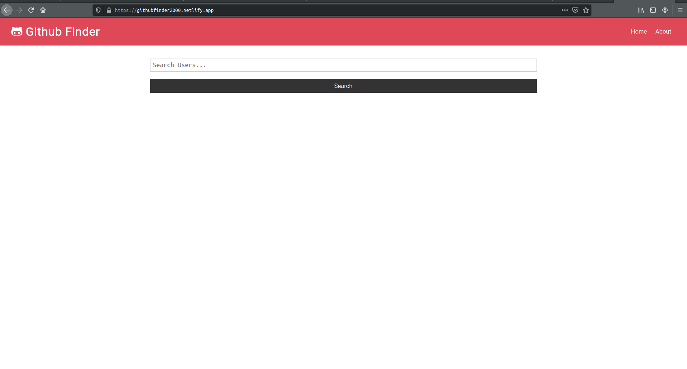
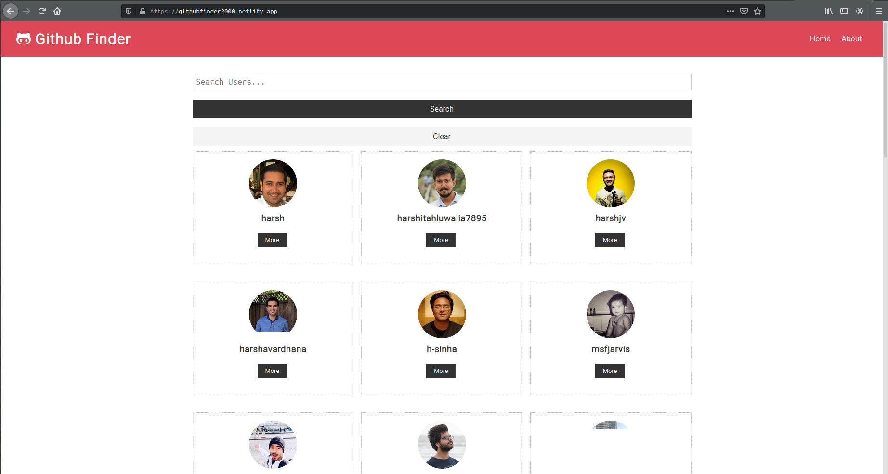
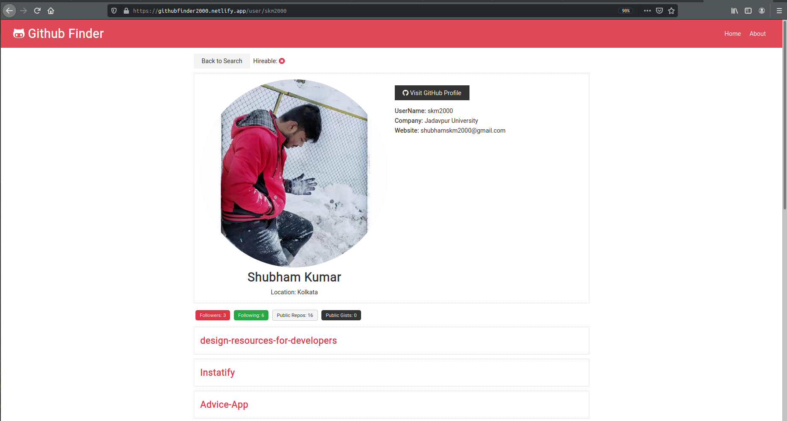
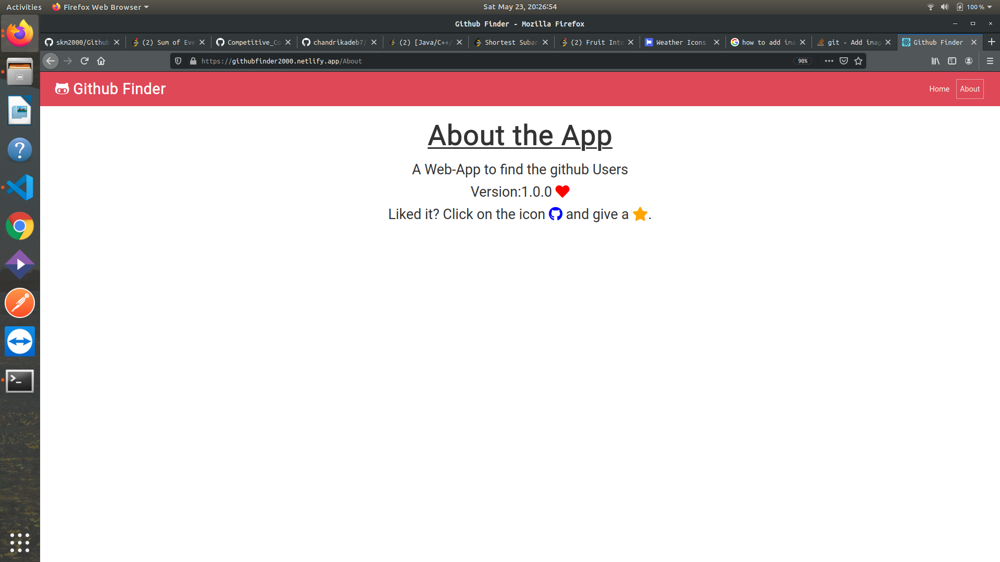

### `npm start`

Runs the app in the development mode. 
Open [https://githubfinder2000.netlify.app/](https://githubfinder2000.netlify.app/) to view it in the browser.

### `Home-Page`

### `Github-Users`

### `User`

### `About-Page`

